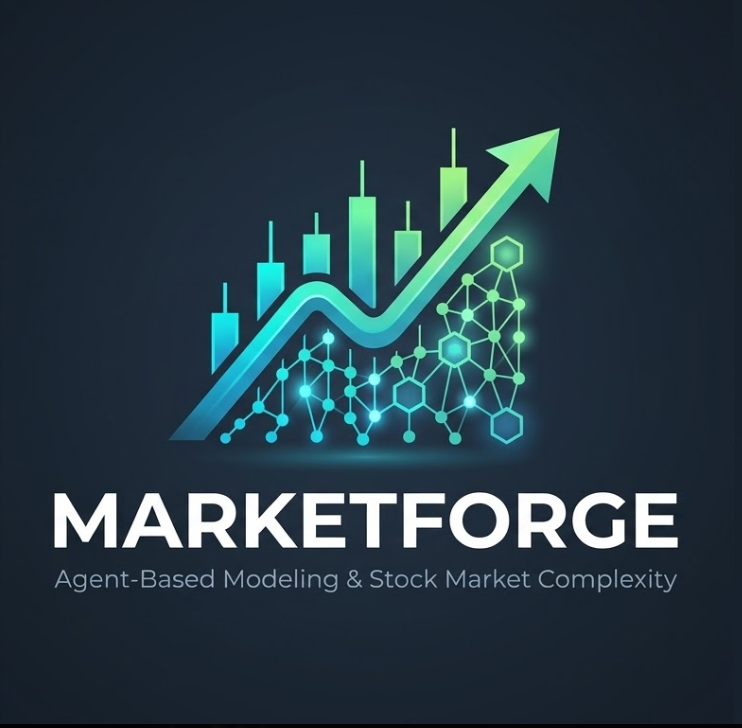

# MarketForge: Agent-Based Financial Market Simulation

**Author:** Ahmed Aribi (1st-Year MPI Engineering Student at INSAT)  
**Advisor:** Oussema Khlifi (Berea College)

## Overview
MarketForge is an object-oriented Python simulation designed to model stock market complexity and emergent wealth inequality using Agent-Based Modeling (ABM). 

By simulating individual traders with varying personalities (cautious, aggressive, random, contrarian) acting within a Barabási-Albert network topology, this project demonstrates how macro-level financial trends emerge from micro-level interactions.

## Documentation:
For more information, check this link: [Marketforge-ABM](https://yxv.notion.site/Stock-Market-Complexity-An-Agent-Based-Modeling-Approach-1c37b49ffa6f8052b0d2d160521e0965)
## Key Features
* **Agent-Based Architecture:** Engineered custom `MarketAgent` and `MarketSimulation` classes to handle localized trading decisions.
* **Network Science Integration:** Utilized `NetworkX` to construct preferential attachment networks, modeling real-world social influence between traders.
* **Algorithmic Optimization:** Analyzed and optimized agent decision-making algorithms (Big-O analysis provided in the project report).
* **Data Visualization:** Built dynamic, data-driven network visualizations using `Plotly` and `Pandas` to track strategy performance and trading clusters.

## Installation & Usage
1. Clone the repository:
   ```bash
   git clone [https://github.com/yourusername/MarketForge-ABM.git](https://github.com/yourusername/MarketForge-ABM.git)
   ```

<p align="center">
  
</p>
